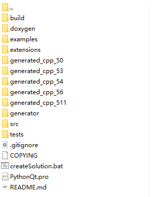
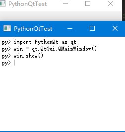
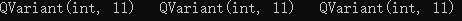
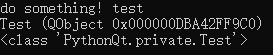
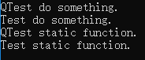
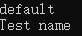
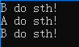

<script>
var _hmt = _hmt || [];
(function() {
  var hm = document.createElement("script");
  hm.src = "https://hm.baidu.com/hm.js?cd03bf82ce30f15dae63f955a16a9695";
  var s = document.getElementsByTagName("script")[0]; 
  s.parentNode.insertBefore(hm, s);
})();
</script>

# PythonQt文档

> 作者：dawnrs
>
> 转发请注明出处！
>
> 注：本文档并非官方文档，一切异议应以官方文档为准。
>
> 注：受能力水平所限，不保证文档的完整性。


## 一、PythonQt简介

### 1. PythonQt概述

不同于PyQt以及PySide等Python的Qt封装库，PythonQt主要用于在你的Qt\C++应用中嵌入Python来为应用提供一个用于方便扩展的脚本引擎。同时基于其方便的扩展机制与自动的在C++与Python间的对象映射转换，PythonQt也为Python提供大部分的Qt类型的封装。

PythonQt的封装依赖与Qt便利的槽信号机制来转发在Python中对C++对象的调用，同时其通过使用Qt的元对象系统能够自动推测并扩展继承自QObject的任何类型，而对于其他的一般类型，只需要提供一个继承自QObject的Warpper即可同样将非QObject类扩展到Python。

如果您正在寻找一种将 Python 对象嵌入到 C++/Qt 应用程序中的简单方法，以及通过 Python 编写应用程序部分脚本的简单方法，则 PythonQt就是你所需要的技术。

PythonQt是一个相对稳定的库，目前基于PythonQt技术来构建Python脚本引擎的知名应用有：

+ **Blender** （开源三维动画制作软件）[[官网]](https://www.blender.org/)
+ **Autodesk Maya**（三维动画制作软件）[[官网]](https://www.autodesk.com/products/maya/overview)
+ **OpenOffice.org**（跨平台的办公室软件套件）[[官网]](http://openoffice.org/)
+ **MeVisLab**（医学图像处理软件）[[官网]](https://www.mevislab.de/)
+ **Scribus** （桌面排版软件）[[官网]](https://www.scribus.net/)

事实上PythonQt正是由开发MeVisLab的德国公司MeVis gGmbH Bremen所开发，PythonQt目前为一个Github上的开源项目，并遵从[](https://github.com/MeVisLab/pythonqt/blob/master/LICENSE "license")开源协议。


相关资源地址如下：

[PythonQt官网](https://mevislab.github.io/pythonqt/)

[PythonQt下载地址](https://github.com/MeVisLab/pythonqt)


阅读本文你需要预先掌握的内容如下：

+ C++的基本内容及常用概念
+ Python的基本内容及常用概念
+ Qt的基本用法与常用概念
+ 了解Python/C API
+ 了解Python解释器的基本运作方式
+ 了解PySide(可选，PythonQt的Qt扩展使用方法类似于PySide，本文对此不做过多阐述)

***

### 2. PythonQt编译

这里介绍在Windows平台下使用Virstual studio 搭配Qt5.9编译

项目目录结构如下



+ 首先你需要打开`build`->`python.prf` 并在开头添加如下字段

```
PYTHON_VERSON = 37
PYTHON_DIR = D:\\python37  
```

其中PYTHON_VERSON用于标识Python的版本 例如 27，37，38，39等。

PYTHON_DIR字段用于标定所使用的Python的目录位置。

+ 然后运行项目根目录下的createSolution.bat来生成VS的解决方案。
+ VS已预装并配置了<kbd>QT Vsiual Studio Tools</kbd>。
+ 选择编译版本(debug 或 release)及平台(x86 或 x64)。
+ 首先生成`PythonQt-Qt5-Python37`。
+ 然后再生成`PythonQt_QtAll-Qt5-Python37`(在这里如果生成失败，请确保使用的编译器与Qt一致)。
+ 最后生成的动态链接库文件保存在根目录下生成的libs文件夹中。
+ 使用PythonQt的头文件位于根目录下的src，使用Qt库所封装组件的头文件位于`extensions`->`PythonQt_QtAll`中。  

**tips**: 当<kbd>createSolution.bat</kbd>无法正常工作时，可以在cmd再次运行它，观察它的错误提示，以便于进行改正。

***


## 二、PythonQt基础

### 1. 初始化PythonQt

```C++
#include <QApplication>
#include <PythonQt.h>
#include <PythonQt_QtAll.h>
#include <gui/PythonQtScriptingConsole.h>
int main(int argc, char *argv[])
{
    QApplication a(argc, argv);
    PythonQt::init();
    PythonQt_QtAll::init();
    
    //do something...
    PythonQtObjectPtr mainm = PythonQt::self()->getMainModule();
    PythonQtScriptingConsole console(nullptr, mainm);
    console.show();
    
    return a.exec();
}
```

让我们先来查看导入的头文件：

+ <kbd>QApplication</kbd>Qt的库，并非本文重点。

+ <kbd>PythonQt.h</kbd>则是用于导入了该库的主要接口。
+ <kbd>PythonQt_QtAll.h</kbd>是用于获取向Python初始化多数Qt常用组件的接口。
+ <kbd>gui/PythonQtScriptingConsole.h</kbd>提供了PythonQt库中所包含的一个简易的Python交互界面，通过继承QTextEdit实现。

在之后本文中将不再关心和介绍关于Qt部分的内容。

首先观察8-9行，其中`PythonQt::init();`用于初始化PythonQt，而`PythonQt_QtAll::init();`则是用于向Python初始化Qt组件的扩展，如果不需要在Python中使用这些扩展则不必进行该步。

其中函数`PythonQt::init`具有两个参数，定义如下：

```C++
static void PythonQt::init(int flags = IgnoreSiteModule|RedirectStdOut, const QByteArray& pythonQtModuleName = QByteArray());
```

| 名称               | 类型                | 描述                                                         |
| ------------------ | ------------------- | ------------------------------------------------------------ |
| flags              | `int`               | 用于标定PythonQt在启动时与启动后的部分行为，这些行为定义在枚举`PythonQt::InitFlags`中 |
| pythonQtModuleName | `const QByteArray&` | PythonQt向Python提供扩展时的模块名，默认为空串，当该字段为空串时，则使用名称"PythonQt"作为Python的扩展模块名，同时可以将扩展名设置为“PySide”或“PyQt”以兼容为它们创建的脚本。 |


枚举PythonQt::InitFlags

| 名称                     | 值     | 描述                                                         |
| ------------------------ | ------ | ------------------------------------------------------------ |
| RedirectStdOut           | 0b0001 | 使用该模块后Python的标准输出流将被重定向到PythonQt的`pythonStdOut()`和`pythonStdErr()`信号中。 |
| IgnoreSiteModule         | 0b0010 | 使用该标志后Python将忽略site模块。[site模块](https://docs.python.org/3/library/site.html) |
| ExternalHelp             | 0b0100 | 设置该信号，则对PythonQt所扩展模块的help()调用转发到pythonHelpRequest()信号下。 |
| PythonAlreadyInitialized | 0b1000 | 使用该标志后，PythonQt在初始化时将不再初始化Python，本标志适用于需要提前初始化Python进行某些操作的场景下。 |


PythonQt的信号

| 定义                                                         | 描述                                                         |
| ------------------------------------------------------------ | ------------------------------------------------------------ |
| `void PythonQt::pythonStdOut(const QString& str);`           | 设置了RedirectStdOut标志时，所有Python的标准输出流<kbd>sys.stdout</kbd>将被转发到该信号下。 |
| `void PythonQt::pythonStdErr(const QString& str);`           | 设置了RedirectStdOut标志时，所有Python的标准错误流<kbd>sys.stderr</kbd>将被转发到该信号下。 |
| `void PythonQt::pythonHelpRequest(const QByteArray& cppClassName);` | 设置了ExternalHelp标志时，所有针对Python下的PythonQt扩展模块的help()调用将被转发到该信号下。 |
| `void PythonQt::systemExitExceptionRaised(int exitCode);`    | 当Python解释器由于异常或是其他原因终止工作时该信号被触发。   |


接下来我们看代码的地12行，其中PythonQt::self()定义如下：

```C++
static PythonQt* PythonQt::self();
```

其用于获取PythonQt对象的指针，PythonQt对象则是由其静态函数init创建，PythonQt的构造函数为私有函数，无法自行通过new创建。

通过PythonQt对象的指针调用`PythonQtObjectPtr Python::getMainModule()`来获得主模块，作为Python语句执行的上下文环境。


最后13行则是PythonQt自带的一个基于QTextEdit的交互式执行界面其构造函数定义如下：

```C++
PythonQtScriptingConsole(QWidget* parent, const PythonQtObjectPtr& context, Qt::WindowFlags i = 0);
```


执行结果如下



***

### 2. 从C++执行Python语句

```C++
PythonQtObjectPtr mainm = PythonQt::self()->getMainModule();
mainm.evalFile("example.py");

Variant ans1 = mainm.evalScript("5 + 6", Py_eval_input);

mainm.evalScript("def func(x, y):\n    return x + y", Py_single_input);
Variant ans2 =  mainm.call("func", QVariantList() << 5 << 6);

PythonQtObjectPtr func = mainm.getVariable("func");
Variant ans3 =  func.call(QVariantList() << 5 << 6);
qDebug()<< ans1 << " "<< ans2 << " " << ans3;
```

对于PythonQtObjectPtr，关于直接执行Python语句我们有三个函数，其定义如下：

```C++
QVariant PythonQtObjectPtr::evalScript(const QString& script, int start = Py_file_input);
QVariant PythonQt::evalScript(PyObject* object, const QString& script, int start = Py_file_input);
QVariant PythonQt::evalScript(const QString& script, PyObject* globals, PyObject* locals, int start);

void PythonQtObjectPtr::evalFile(const QString& filename);
void PythonQt::evalFile(PyObject* object, const QString& filename);

QVariant PythonQtObjectPtr::evalCode(PyObject* pycode);
QVariant PythonQt::evalCode(PyObject* object, PyObject* pycode);
```

实际上这三条函数均是为了方便包装自调用自PythonQt的同名函数，并把自己作为第一个参数，这类似于代理模式与装饰器模式的结合，后文还有许多这样的处理。

其中关于`evalCode`在这里暂时不做论述，PyCodeObject可以通过parseCode函数获得，将在后文介绍。

`evalFile`函数较为简单，filename参数是指要执行脚本的的路径。

关于`evalScript`中 script参数均为要执行的Python语句，前两个`evalScript`为一组，最后一个`evalScript`可以通过自身指定两个`dict`对象作为全局环境和局部对象来执行一条Python语句。

对于start参数的宏有如下定义:

| 宏定义          | 值   | 描述                                       |
| --------------- | ---- | ------------------------------------------ |
| Py_single_input | 256  | 是指将要执行Python代码串为一个简单的语句。 |
| Py_file_input   | 257  | 是指将要执行Python代码串为一个文件。       |
| Py_eval_input   | 258  | 是指将要执行Python代码串为一个表达式。     |

事实上这些宏将作为这些Python代码编译后运行时所使用的启动令牌，在这里不做详述。


接下来我们关注下函数的调用

```C++
QVariant PythonQtObjectPtr::call(const QString& callable, const QVariantList& args = QVariantList(), const QVariantMap& kwargs = QVariantMap());
QVariant PythonQt::call(PyObject* object, const QString& name, const QVariantList& args, const QVariantMap& kwargs)

QVariant PythonQtObjectPtr::call(const QVariantList& args = QVariantList(), const QVariantMap& kwargs = QVariantMap());
QVariant PythonQt::call(PyObject* callable, const QVariantList& args, const QVariantMap& kwargs)
```

关于对函数的调用分为两大类，主要应用于指针所指向的两个不同类型的对象。

第一组应用于上下文环境类型的对象，比如模块，字典对象等，它通过callable字符串来作为名称从上下文中搜索对应的可执行对象，然后args与kwargs分别作为参数列表和关键字参数字典传入函数并执行。

第二组则是应用于可调用对象的情况下，其他参数定义不变。


最后我们关注下关于处理变量相关的函数

```C++
QVariant PythonQtObjectPtr::getVariable(const QString& name);
QVariant PythonQt::getVariable(PyObject* object, const QString& name);

void PythonQtObjectPtr::addVariable(const QString& name, const QVariant& v);
void PythonQt::addVariable(PyObject* object, const QString& name, const QVariant& v);

void PythonQtObjectPtr::removeVariable(const QString& name);
void PythonQt::removeVariable(PyObject* module, const QString& name);
```

它们分别时用于获取变量，添加变量以及删除变量，唯一应注意的时PythonQtObjectPtr可以转换为QVariant。

在这里补充一点关于智能指针PythonQtObjectPtr一般用于包装传统的Python/C API中的`PyObject*`指针， 其可以在`PyObject*`与`QVariant`之间自动转换，同时使用前应确保该指针不为空这一点可以使用函数`bool PythonQtObjectPtr::isNull()`来判断，如果为空，可能程序并不会报错，只是对该调用不做处理。

本段示例的执行结果为：



***

### 3. 将C++对象映射到Python

**C++:**

```C++
class Test: public QObject{
Q_OBJECT
public:
    Q_INVOKABLE void doSomething(QString str){std::cout<<"do something! " << str.toStdString() << std::endl;}
}
```

```C++
int main()
{
    QApplication a(argc, argv);
    PythonQt::init();
    PythonQt_QtAll::init();
    PythonQtObjectPtr mainm = PythonQt::self()->getMainModule();
    
    Test t;
    main.addObject("test", &t);
    
    mainm.evalFile("example.py");
    return a.exec();
}
```


**Python:**

```python
import PythonQt as qt
test.doSomething("test")
print(test)
print(w.private.Test)
```


本节仅涉及一个新的函数，定义如下：

```C++
void PythonQtObjectPtr::addObject(const QString& name, QObject* object);
void PythonQt::addObject(PyObject* object, const QString& name, QObject* qObject);
```

name为添加的变量名，object为要添加的对象，应注意的是该函数只支持QObject及其子对象。

如果该函数添加的对象所属的类型没有被注册，则PythonQt会将其类型隐式注册到主模块下的private模块中。关于类映射会在下一部分讨论。

还应当注意，在该部分程序被执行后，可能没有在控制台产生Python的打印内容，因为i默认情况下，这些打印被重定向到`pythonStdOut`信号中了, 你应该做的是连接这个信号，并且在C++中来打印传来的信息，注意换行符，发来信息内可能是带有换行符的。

本段示例的执行结果为：



***

### 4. 将C++类映射到Python

**C++:**

```C++
class QTest: public QObject{
Q_OBJECT
public:
    Q_INVOKABLE void doSomething(){std::cout << "QTest do something." << std::endl;}
    Q_INVOKABLE static void doStatic(){std::cout << "QTest static function." << std::endl;}
}

class Test{
public:
    void doSomething(){std::cout << "Test do something." << std::endl;}
    static void doStatic(){std::cout << "Test static function." << std::endl;}
}

Q_DECLARE_METATYPE(Test);

class Warpper1: public QObject{
Q_OBJECT
public Q_SLOTS:
    QTest* new_QTest(){return new QTest;}
    void delete_QTest(QTest* obj){delete obj;}
    void static_QTest_doStatic(){QTest::doStatic();}
}

class Warpper2: public QObject{
Q_OBJECT
public Q_SLOTS:
    Test* new_Test(){return new QTest;}
    void delete_Test(Test* obj){delete obj;}
    void doSomething(Test* obj){obj->doSomething();}
    void static_Test_doStatic(){Test::doStatic();}
}
```

```C++
int main()
{
    QApplication a(argc, argv);
    PythonQt::init();
    
    PythonQt::self()->registerClass(&QTest::staticMetaObject, "TestModule", PythonQtCreateObject<Warpper1>);
    PythonQt::self()->registerCPPClass("Test", "", "TestModule", PythonQtCreateObject<Warpper2>);
    
    PythonQtObjectPtr mainm = PythonQt::self()->getMainModule();
    mainm.evalFile("example.py");
    return a.exec();
}
```


**Python:**

```python
import PythonQt as qt
t1 = qt.TestModule.QTest()
t2 = qt.TestModule.Test()
t1.doSomething()
t2.doSomething()
qt.TestModule.QTest.doStatic()
qt.TestModule.Test.doStatic()
```


向Python扩展一个类的一般思路如下：

1. 获取要扩展的原始类
2. 为这个类中要扩展的接口编写Warpper类
3. 将这个类注册到PythonQt中

要扩展的类如果是属于QObject的子类，则仅需要把需要扩展的函数以宏`Q_INVOKABLE`标识，并在Warpper类中声明构造和析构接口以及静态接口即可，其他信息通过Qt的元对象系统进行自推测得到，最后通过`registerClass`函数完成注册。

如果要扩展的类为一般的C++类，需要通过宏`Q_DECLARE_METATYPE`使其支持元系统，同时不仅需要编写构造和析构接口，并且需要编写所有其他的扩展接口，最后由函数`registerCPPClass`完成注册。

还应注意的是，QObject相关类注册后支持大部分Qt的特性，而一般的C++类注册后并不支持，关于Qt的特性在后文讨论， 除此之外，C++类在注册时应保证其父类也被注册，并在注册函数中指定其父类。

你还应当注意的是你应避免具有同名函数的类共用同一个warpper，因为这回在内部调用时造成混乱，使得发生不可预知的结果。

Warpper的扩展接口命名规则如下：

+ ClassName* new_ClassName ( args... );  构造函数定义
+ void delete_ClassName ( ClassName* obj ); 析构函数定义
+ anything static_ClassName_functionName ( args... ); 静态函数定义
+ anything functionName ( ClassName* obj, args... ); 一般函数定义

接下来我们看两个注册函数的定义：

```C++
void PythonQt::registerClass(const QMetaObject* metaobject, const char* package = NULL, PythonQtQObjectCreatorFunctionCB* wrapperCreator = NULL, PythonQtShellSetInstanceWrapperCB* shell = NULL);
void PythonQt::registerCPPClass(const char* typeName, const char* parentTypeName = NULL, const char* package = NULL, PythonQtQObjectCreatorFunctionCB* wrapperCreator = NULL, PythonQtShellSetInstanceWrapperCB* shell = NULL);
```

上述两个函数中同名参数的作用是一致的，首先package为一个包名，用以确定将类注册到哪个包中， wrapperCreater为一个wrapper的创建者，一般通过模板`PythonQtCreateObject<T>`来构造，其中T为Warpper类名，最后一个参数shell是用来管理用来包装Python端所使用的结构体，目前不对其做任何讨论，使用默认的NULL即可。

对于第一个注册函数的第一个参数为所注册类的元数据，对于第二个函数前两个参数分别为类名名和父类类名。

最后一点需要注意的是，应避免有重复的类名（即便它们在不同的模块内，类名也不能重复），一旦出现重复的类名只会注册第一次出现的类。应当小心addObject会隐式的注册类，如果在注册类之前调用了addObject添加相同类的函数，那么这个类则只会被注册到private模块下。

本段示例执行结果如下： 



***

### 5. 在Python端使用Qt库

```python
from PythonQt.QtGui import *

group = QGroupBox()
box = QVBoxLayout(group)
push1 =  QPushButton(group)
box.addWidget(push1)
push2 =  QPushButton(group)
box.addWidget(push2)
check =  QCheckBox(group)
check.text = 'check me'
group.title = 'my title'
push1.text = 'press me'
push2.text = 'press me2'
box.addWidget(check)
group.show()
```

唯一要注意的是，你别忘记调用PythonQt_QtAll::init()，PythonQt对于Qt组件的封装类似于PySide，如果能掌握原生的Qt，对于其Python扩展模块也能轻易的来掌握。

本段示例执行结果如下：


***

### 6. 装饰器的应用

```C++

class YourCPPObject {
public:
  YourCPPObject(int arg1, float arg2) { a = arg1; b = arg2; }
  float doSomething(int arg1) { return arg1*a*b; };
  private:
  int a;
  float b;
};

class ExampleDecorator : public QObject
{
Q_OBJECT
public slots:
  // 添加一个从QPoint构造QSize的构造函数
  QSize* new_QSize(const QPoint& p) { return new QSize(p.x(), p.y()); }
  // 添加一个新的QPushButton的构造函数
  QPushButton* new_QPushButton(const QString& text, QWidget* parent=NULL) { return new QPushButton(text, parent); }
  // 为C++类添加一个构造函数
  YourCPPObject* new_YourCPPObject(int arg1, float arg2) { return new YourCPPObject(arg1, arg2); }
  // 为C++类添加一个析构函数
  void delete_YourCPPObject(YourCPPObject* obj) { delete obj; }
  // 为QWidget添加一个静态函数
  QWidget* static_QWidget_mouseGrabber() { return QWidget::mouseGrabber(); }
  // 为QWidget添加一个move槽函数
  void move(QWidget* w, const QPoint& p) { w->move(p); }
  // 为QWidget添加一个重载的槽函数
  void move(QWidget* w, int x, int y) { w->move(x,y); }
  // 为C++对象添加一个成员函数
  int doSomething(YourCPPObject* obj, int arg1) { return obj->doSomething(arg1); }
};
```

```C++
PythonQt::self()->addDecorators(new ExampleDecorator()); //添加这个新的装饰器
PythonQt::self()->registerCPPClass("YourCPPObject"); //注册新的类型名称
```

```python
from PythonQt import QtCore, QtGui, YourCPPObject
# 调用QSize的新的构造函数
size = QtCore.QSize(QPoint(1,2));
# 调用QPushButton新的构造函数
button = QtGui.QPushButton("sometext");
# 调用QWidget的新的槽函数
button.move(QPoint(0,0))
# 调用QWidget新的槽函数的一个重载
button.move(0,0)
# 调用新添加的静态函数
grabber = QtGui.QWidget.mouseWrapper();
# 调用C++类型的构造函数
yourCpp = YourCPPObject(1,11.5)
# 调用C++类的成员函数
print yourCpp.doSomething(1);
# C++成员的析构函数将被调用
yourCpp = None
```

PythonQt的装饰器主要用于扩展全体已注册类，动态为它们添加成员函数或是构造函数。

这个例子也为我们提供一个新的注册类型的方案，我们仅仅注册类名，然后通过装饰器的方式为其添加构造函数、析构函数以及成员函数。

***

### 7. 对象的拥有权及拥有权转换

对象的拥有权是指，对象的生命周期由哪一方所控制。所有权基本原则如下：

+ 当对象由C++创建，那么其所有权归C++所有，即便其在Python内引用计数归0也不会被释放。
+ 当对象由Python创建，那么其所有权归Python所有，一旦引用计数归0，则无论C++是否存在控制它的指针，对象都会被释放。

因此，为确保程序能正确安全的运行，避免出现野指针，当对象所处环境发生改变时，我们应当合理地变更其所属的语言。

在PythonQt中，对象所有权的控制由以下三个模板类实现：

```C++
template<class T>
class PythonQtPassOwnershipToCPP; //所有权由Python转换到C++

template<class T>
class PythonQtPassOwnershipToPython; //所有权由C++转换到Python

template<class T>
class PythonQtNewOwnerOfThis; //当对象由Python管理时， 为当前环境使对象的引用计数加一。
```

对于这些模板，他们的实例可以和所包装类型`T`的实例实现自动转换。

对与前两个模板，一旦对象由它们的实例所持有，对象的拥有权就会发生改变。

对于最后一个模板，当其实例存在时，就相当于Python对象被一个变量所引用，当其被销毁时，相当于Python对象被一这个变量放弃了引用。

一般前两个模板常用于对象需要长期交给另一方管理和使用，自己创建后不再使用，而最后一个模板常用于临时使用，临时持有一个引用，避免在使用过程中对象被Python的GC回收。

对于循环引用，我还没有进行深入研究，不确定这些对象对于循环引用的控制是否得当，所以目前应当谨慎使用循环引用。

***

### 8. 类型自动转换

自动类型转变表如下所示，它们是PythonQt内部所支持的自动转换。

| Qt/C++                                           | Python                                                       |
| ------------------------------------------------ | ------------------------------------------------------------ |
| bool                                             | bool                                                         |
| double                                           | float                                                        |
| float                                            | float                                                        |
| char/uchar,int/uint,short,ushort,QChar           | integer                                                      |
| long                                             | integer                                                      |
| ulong, longlong, ulonglong                       | long                                                         |
| QString                                          | unicode string                                               |
| QByteArray                                       | QByteArray wrapper                                           |
| char*                                            | str                                                          |
| QStringList                                      | tuple of unicode strings                                     |
| QVariantList                                     | tuple of objects                                             |
| QVariantMap                                      | dict of objects                                              |
| QVariant                                         | depends on type                                              |
| QSize, QRect and all other standard Qt QVariants | variant wrapper that supports complete API of the respective Qt classes |
| OwnRegisteredMetaType                            | C++ wrapper, optionally with additional information/wrapping provided by registerCPPClass() |
| QList<AnyObject*>                                | converts to a list of CPP wrappers                           |
| QVector<AnyObject*>                              | converts to a list of CPP wrappers                           |
| EnumType                                         | Enum wrapper derived from python integer                     |
| QObject (and derived classes)                    | QObject wrapper                                              |
| C++ object                                       | CPP wrapper, either wrapped via PythonQtCppWrapperFactory or just decorated with decorators |
| PyObject                                         | PyObject                                                     |

所有通过Python获取的内容，一般情况下会保存在QVariant中，转换由如下几种情况：

+ 获取值如果是数字，字符串，则通过QVariant自带的转换方法即可，

+ 获取值如果是原生的Python对象，则可以直接转换为PythonQtObjectPtr进行操作，这里注意一定是原生Python对象。
+ 如果是注册对象（包括PythonQt提供的Qt组件），则应通过`QVariant::value<Object*>()`转换为对应指针进行操作。

***


## 三、PythonQt的其他内容

### 1. 模块的获取及创建

对于PythonQt，获取模块的方法如下：

```C++
PythonQtObjectPtr PythonQt::getMainModule(); //获取主模块
PythonQtObjectPtr importModule(const QString& name); //获取某个Python模块 例如 sys、os等
PythonQtObjectPtr PythonQt::createModuleFromFile(const QString& name, const QString& filename); //由某个文件创建模块
PythonQtObjectPtr PythonQt::createModuleFromScript(const QString& name, const QString& script = QString()); //由某段代码创建模块
PythonQtObjectPtr PythonQt::createUniqueModule(); //创建一个匿名模块
PyObject* PythonQtPrivate::packageByName(const char* name); //创建一个挂载在主模块下名字为name的模块
```

对于以上方法，格外要说明的是第三和第四种方法，它们所创建的模块可以在Python中通过 `import name`来导入。

对于最后一个模块，其主要用于创建一个孤立的运行环境。

在使用这些模块时，应当尽可能避免频繁的创建和销毁匿名模块作为新的运行环境，这种方法不是一个高效的方法，正确的做法是应当尽可能的复用这些模块，例如使用后将其内部的环境清理干净后等待下一次被使用(甚至你可以专门创建一个匿名模块，来将使用最为频繁的外部模块保存下来，避免其频繁地向Python导入)。

对于最后一个方法，其位于`PythonQtPrivate`对象下，这个对象是PythonQt的内部私有对象，不推荐直接使用它，但我发现有时可能需要一种方法来创建挂载在主模块下的子模块，所以将它列在在这里，同时该方法为私有方法，如果必须使用则需要对原始代码做出一定的修改，所以在这里不推荐使用。

获取PythonQtPrivate对象的方法如下：

```C++
static PythonQtPrivate* PythonQt::priv();
```

这里还应注意的是，在C++中，应将`PyObject*`转换为`PythonQtObjectPtr`来使用。

***

### 2. GIL锁与多线程支持

由于Python初期的设计问题，使得它内部在运行时会使用一些非线程安全的全局变量，这使得Python在支持多线程上存在一定问题，为了使得Python能安全地支持多线程，于是Python内部集成了GIL锁，只有持有GIL锁的线程才能被运行，Python内部会不断的改变GIL的所属权，使得每个线程能看起来在并行。

如果你只是希望在Python运行期间使用其内部的多线程，那么你不必启用多线程支持，只要使用Python对多线程原始支持方案即可。

如果你希望在C++多线程上执行Python，那么你需要启用PythonQt对于多线程的支持。

```C++
static void PythonQt::setEnableThreadSupport(bool flag); //传入true时启用多线程支持，传入false则关闭支持。
```

在线程函数中由如下定义：

```C++
#include <PythonQtThreadSupport.h> //线程相关宏被定义在这个头文件中，也包括下面将介绍的宏
void threadFunction()
{
    PYTHONQT_GIL_SCOPE;
    // do something
}

//PYTHONQT_GIL_SCOPE 的实际定义为
#define PYTHONQT_GIL_SCOPE PythonQtGILScope internal_pythonqt_gilscope;
//当这个对象存在时，我们认为进入了GIL作用域
```

应当注意的是，一旦启用了多线程支持，就应确保每条Python语句都运行在GIL域下，否则会存在Python的崩溃的风险。

对于多线程，还存在一个特征，那就是由Python创建的线程只会运行在某些Python代码运行的条件下，一旦程序交由C++控制时，这些线程就会进入睡眠，当程序再次交给Python控制时，这些线程会被重新唤醒。

为解决这一问题，我们可以为Python提供一个C++线程类，以及其同步方案，但这一方法较为麻烦，PythonQt为我们提供了另一个宏来使当程序在C++控制下时，Python线程仍能继续运行。

```C++
// 相关操作宏定义如下
#define PYTHONQT_ALLOW_THREADS_SCOPE PythonQtThreadStateSaver internal_pythonqt_savethread;
// 当这个对象存在时，我们认为进入了允许Python运行的域，此时所有Python线程会被唤醒，并运行，直到离开这个域。
// 应当格外注意，这个宏不能使用在GIL域下，如果在GIL域下使用，可能会引发程序崩溃。
```

最后应当注意的是这两个域的叠加效果，当这个域与GIL域同时影响某一组代码时，当这组代码在执行Python程序时，Python的线程被允许执行，当这组代码在GIL域执行C++代码时，Python线程将进入睡眠。

***

### 3. 枚举的映射

```C++
class MyEnum: public QObject
{
Q_OBJECT
public:
	explicit MyEnum(QObject* parent = NULL):QObject(parent){};
    enum Priority{
        High = 1,
        Middle = 2,
        Low = 4
    }
    Q_ENUM(Priority);
    Q_DECLARE_FLAGS(PriorityFlags, Priority);
    Q_FLAG(PriorityFlags);
}
Q_DECLARE_OPERATORS_FOR_FLAGS(MyEnum::PriorityFlags);
```

```C++
PythonQt::self()->registerClass(MyEnum::staticMetaObject, "Test");
```

```python
import PythonQt as qt
print(qt.Test.MyEnum.High)
print(qt.Test.MyEnum.Middle)
print(qt.Test.MyEnum.Low)
```

如果仅仅是在Python端使用，则可以只使用Q_ENUM进行声明，不必使用Q_FLAG等一系列宏。

一般情况下，不需要为枚举单独注册一个类，而只需要将枚举声明在使用它的类中即可。

这些枚举的类型对象也保存在所注册类中。

执行结果如下：


***

### 4. 对象属性的映射

```C++
class InfoTest: public QObject{
Q_OBJECT
public:
   	Q_PROPERTY(QString name WRITE setName READ getName);
    void setName(const QString& name){this->name = name;}
    QString getName(){return name;}
private:
    QString name = "default";
};
```

```C++
PythonQt::self()->registerClass(InfoTest::staticMetaObject, "Test", PythonQtCreateObject<Warpper>);
```

```python
import PythonQt as qt
info = qt.Test.InfoTest()
print(info.name)
info.name = "Test name"
print(info.name)
```

对象属性的映射依赖于Qt的属性系统，可以通过设置不同的属性内容，来控制一条属性的只读、只写或是读写皆可。

执行结果如下：



***

### 5. 函数返回类对象的获取

当通过Python代码创建Python对象时，则会正确执行，只要记得将其拥有者转换为C++即可。

而当你试图调用某个函数，来获取函数返回的某个在函数中创建的对象时，你可能会发现，这个对象在返回时竟然意外被释放了，QVariant中只是保存了一个野指针，或是一个空的PythonQtObjectPtr。

针对这种情况，我猜测可能是PythonQt不能判断你是否需要这个返回值，故其对于返回值的处理只是将它转换后保存于QVariant中，并没有在内部为这个对象添加引用。

因此，你不必担心在返回数字和字符串时，对象被意外的销毁，因为它在可能的销毁前已经被PythonQt转换为对应的C++格式保存在QVariant中。而对于其他对象，PythonQt只是会将其转换为对应的指针，当对象被销毁后，QVariant中所保存的指针也就成为了野指针。

解决这一问题的直接方法就是在代码内部手动添加一个引用给对象，避免直接获取Python函数所返回的对象，例子如下：

```python
def call():
	global call
    call.temp = object()
    return call.temp
call.temp = None
```

```C++
PythonQtObjectPtr object = PythonQtPassOwnershipToCPP<PythonQtObjectPtr>(mainm.evalScript("call()", Py_single_input));
```

这个函数可以被直接调用，对于使用别人设计的函数时，可以通过更直接的方法避免释放：

```C++
mainm.evalScript("temp = createSomething()", Py_single_input);
Something* sth = PythonQtPassOwnershipToCPP<Something*>(mainm.getVariable("temp").value<Something*>());
mainm.evalScript("del temp", Py_eval_input);
```

***

### 6. 映射类的Python继承

这些由PythonQt所映射的类在Python中是可以让Python类从它继承的，甚至你还可以重写其中的函数。

但这些类所创建的对象在返回时，会被转换为在继承链上离它最近的那个注册类的实例指针(多重继承时也遵循这个规律)。

在继承中被重写的函数再C++下调用，重写的新内容将不会再生效，而是执行原本C++所定义的内容。

如果想在C++中以Python类的形式调用这个对象，你需要获取它所对应的类型对象，并通过类型对象调用具体函数，具体例子如下：

```C++
class A:public QObject{
Q_OBJECT
public:
    void dosth(){std::cout<<"A do sth!"<<std::endl;}
}
class Warpper:public QObject{
Q_OBJECT
public:
	A* new_A(){return new A;}
    void delete_A(A* obj){delete A;}
}
```

```C++
PythonQt::self()->registerClass(A::staticMetaObject, "Test", PythonQtCreateObject<Warpper>);
```

```python
import PythonQt as qt
class B(qt.Test.A):
    def dosth(self):
        print("B do sth!")
obj = B()
obj.dosth()
```

```C++
mainm.evalFile("example.py");
A* obj = main.getVariable("obj").value<A*>();
obj->dosth();
PythonQtObjectPtr type_B = main.getVariable("B");
type_B.call("dosth", QVariantList() << QVariant::fromValue(obj)); // 等价于Python中的 B.dosth(obj)
```

执行结果如下：



***

### 7. Qt特征的支持

对于所有基于QObject所映射的类型，PythonQt为他们提供了完整的Qt五大核心特性的支持，这些特性包含：

+ 元数据支持

  ```python
  obj.className() #返回所属类的类名
  obj.help() #返回所属类的信息(包含: 类名，构造函数定义，成员函数定义，静态函数定义，以及信号的定义)。
  #实际上除了构造函数与析构函数外，其余的函数均被定义为用于包装的槽。
  ```

  

+ 信号与槽的支持

  ```python
  obj.connect(signal:str, function) #用于将信号与一般的Python函数相连接。
  obj.disconnect(signal:str, function) #与之对应的解除连接的方法。
  
  obj.connect(signal:str, qobj, slots) #使信号与某个QObject的槽进行连接
  obj.disconnect(signal:str, qobj, slots) #与之对应的解除连接的方法。
  ```

  

+ 对象树的支持

  ```python
  obj.setParent(obj:QObject) #设置父对象
  obj.parent() #获取父对象
  obj.children() #获取子对象
  ```

  

+ 属性系统支持

  ```python
  obj.setPorperty(name:str, item) #设置属性
  obj.porperty(name:str) #获取属性
  #事实上，它们可以象普通的Python对象那样获取属性
  name = obj.name
  obj.name = name
  #但切记，其不可以如同Python一样创建动态属性，必须通过函数进行创建
  ```

  

+ 对象模型的支持

  ```python
  obj.delete() #删除所包装的对象，该方法一定要慎用，避免C++部分出现野指针。
  obj.setObjectName(name:str) #该方法还可以直接通过属性来获取和更改。
  obj.objectName = "xxx"
  obj.findChild(name:str) #基于objectName对子对象进行查询。
  obj.findChildren(name:str)
  ```


实际上除了支持以上Qt的核心特性外，PythonQt还支持如事件系统，语言系统等其他特性系统，这里不再进行详述。

***

### 8. 手动编译Python部分代码

这部分仅需要介绍编译代码的部分函数，会生成一个PyCodeObject,然后搭配evalCode函数执行即可。

```C++
PythonQtObjectPtr parseFile(const QString& filename); \\这个函数将使用PythonQt库的导入机制进行加载和编译，返回PyCodeObject对象。
PythonQtObjectPtr parseFileWithPythonLoaders(const QString& filename);\\这个函数使用Python的机制进行导入，支持有源和无源代码的加载。
```


***

### 9. 其他常用函数

```C++
void PythonQt::overwriteSysPath(const QStringList& paths); //重写系统查询路径
void PythonQt::addSysPath(const QString& path); //添加系统查询路径
void PythonQt::setModuleImportPath(PyObject* module, const QStringList& paths); //设置模块导入的路径
PythonQtObjectPtr PythonQt::lookupCallable(PyObject* object, const QString& name); //查询一个对象中的某个可调用对象
QString PythonQt::getReturnTypeOfWrappedMethod(PyObject* module, const QString& objectname); //
QString PythonQt::getReturnTypeOfWrappedMethod(const QString& typeName, const QString& methodName); //
PyObject* PythonQt::callAndReturnPyObject(PyObject* callable, const QVariantList& args = QVariantList(), const QVariantMap& kwargs = QVariantMap()); //调用一个函数，并且以PyObject*的形式返回其返回值
bool PythonQt::hadError()const; //判断是否存在异常
void PythonQt::clearError(); //清除异常
PythonQtObjectPtr PythonQt::lookupObject(PyObject* module, const QString& name); //查询模块中是否存在某个变量
```


***

## 四、PythonQt官方示例分析

### 没啥内容懒得总结了

### 1. PyGettingStarted


***

### 2. PyScriptingConsole


***

### 3. PyLauncher


***

### 4. PyGuiExample


***

### 5. CPPPyWrapperExample


***

### 6. PyCPPWrapperExample


***

### 7. PyDecoratorsExample


***

### 8. PyCustomMetaTypeExample


***


## 五、PythonQt源码分析

### 还在努力了解中

***

